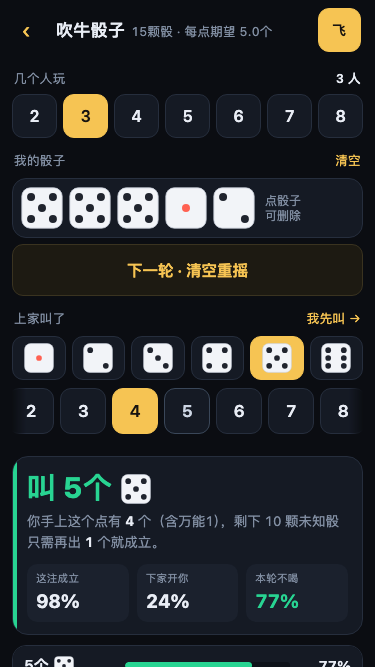
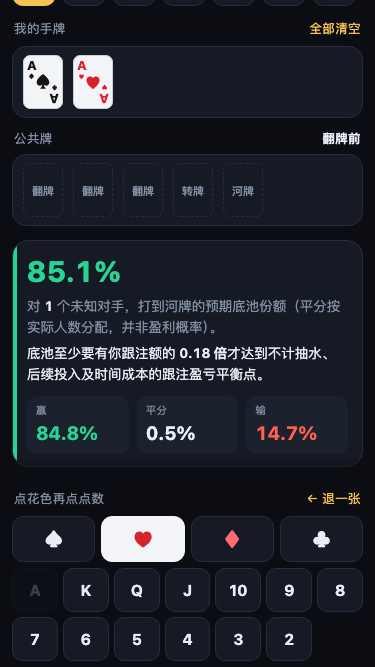
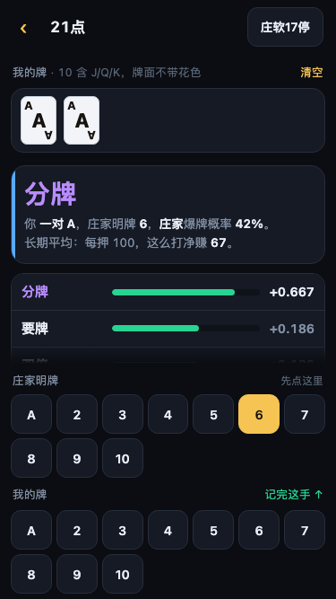

# Bar Tools · bar.leonardchow.work

Four card/dice calculators built for the environment they're actually used in:
a dim bar, one hand on the phone, someone waiting for you to act.

**[Open → bar.leonardchow.work](https://bar.leonardchow.work)** · single static file · works offline · installable to home screen · everything computes on your device

*[中文说明](README.zh-CN.md)*

| Tool | What it answers |
|---|---|
| 🎲 **Liar's Dice** (吹牛/大话骰) | Given the player count, your dice, and the standing bid — challenge, or raise to what? |
| ♠♥ **Texas Hold'em** | Hole cards + board + opponent count → equity to the river, and how big the pot must be for a call to break even |
| **Blackjack** | Your hand + dealer upcard → hit/stand/double/split/surrender ranked by exact EV, plus a Hi-Lo counter |
| **24 Game** | Four cards → every solution, found with exact rational arithmetic |

<p align="center">
  
  
  
  
</p>

---

## Why you should believe the numbers

A tool used at a gambling table is worse than useless if it's subtly wrong.
So the substance of this project isn't the features — it's the evidence that
the math is right.

### Every engine is anchored to an externally checkable fact

| Engine | Anchor |
|---|---|
| Hold'em evaluator | All C(52,5) = 2,598,960 five-card hands enumerated. The nine category counts must **exactly** equal the combinatorial results: 40 straight flushes, 624 quads, 3,744 full houses, 5,108 flushes, 10,200 straights, 54,912 trips, 123,552 two pair, 1,098,240 one pair, 1,302,540 high card |
| Hold'em equity | Suit-averaged AA vs KK measures **81.90%** against the published 81.9%; AKs vs QQ measures 46.0% |
| Blackjack | No built-in strategy chart — EV is computed recursively from the rules. Playing basic strategy end to end yields **−0.570%** (S17 + DAS), **−0.789%** (H17), **−1.923%** (6:5 blackjack), all matching the published house edges |
| 24 Game | **1,362** of the 1,820 four-card multisets from 1–13 are solvable, matching the commonly cited figure |
| Liar's Dice | "This bid holds" is an exact binomial tail, cross-checked case by case against 400k Monte Carlo trials to three decimal places |

### Gates have to be proven to fire

All-green means nothing if the tests can't fail. Every layer ships with fault
injection: a specific bug is written into the engine and the matching test is
required to break.

```
395  unit assertions          node test/verify-{dice,24,holdem,blackjack}.js
 78  fault injections         node test/fault-{inject,24,holdem,blackjack}.js   0 escapes
184  real-browser assertions  python3 test/browser.py       (number reconciliation, tap targets, offline)
 17  anonymous live checks    python3 test/live-smoke.py    (including a real offline test)
     thumb reachability       python3 test/thumb-reach.py [w h]
```

`./build.sh` runs every gate first and **refuses to emit `site/index.html` if
any of them fails**. The bytes tested under node are inlined into the HTML
verbatim (literal substitution, no regex), so there is no "verified A, shipped B".

### Eight rounds of adversarial external review

`reviews/` holds the complete record: two independent reviewers — one auditing
only the math, one only the interaction — went eight rounds and filed 20+
findings. **Every single one reproduced; none was a false positive.**

The most valuable findings weren't "the math is wrong." They were **"the test
passed for the wrong reason"**:

- A gate re-implemented the elimination formula instead of exercising the
  production path — mutating the real code left it green.
- A gate scanned for `NaN|undefined|Infinity` while the actual symptom was
  `±—` next to a fabricated simulation count. The symptom wasn't in the list.
- A gate froze a **factual error** into an assertion: it demanded that a
  position display "no legal raise left" when the rules still permitted eight.

That class of defect is nearly impossible to find alone, because whoever wrote
the test and whoever wrote the code share the same blind spots.

---

## Running it

```bash
node --version                                            # Node 18+
pip install playwright && playwright install chromium     # for browser tests

./build.sh                                                # runs all gates, emits site/
python3 -m http.server 8000 --directory site
```

### The test layers

```bash
node test/verify-dice.js          # liar's dice engine
node test/verify-holdem.js        # hold'em (includes the full C(52,5) census)
node test/verify-blackjack.js     # blackjack (includes a 400k-hand MC reconciliation)
node test/verify-24.js            # 24 game (includes the full 1,820-set census)

node test/fault-inject.js         # fault injection: proves the gates above fire
node test/fault-holdem.js
node test/fault-blackjack.js
node test/fault-24.js

python3 test/browser.py           # real browser: click-throughs, number reconciliation, geometry
python3 test/live-smoke.py [url]  # anonymous production check (includes offline)
python3 test/thumb-reach.py 375 667
```

### Measurement, not pass/fail

```bash
node test/robustness.js       # strategy strength against three structurally different opponents
node test/ranker-split.js     # evidence table behind the per-player-count ranker split
node test/band-safety.js      # global safety sweep of the elimination band
node test/calibrate.js        # parameter calibration
```

---

## A few non-obvious design decisions

**The liar's dice ranker splits on player count.** `N ≥ 3` uses a rollout —
freeze the bid and play the round out against modelled opponents. `N = 2` uses
a two-ply lookahead model instead. This wasn't designed, it was measured: heads
up, the rollout lost to the two-ply model against all five opponent types, and
five different tunings failed to rescue it. The evidence table lives in
`test/ranker-split.js`.

**Elimination cuts by noise band, never by rank.** Coarse rounds have few
samples and lots of noise; the true optimum can easily land fifth. Keeping "the
top N" therefore discards it permanently — external review found two such
counterexamples. Bands now narrow as samples grow (4.5σ → 3.5σ → 3.0σ), and a
global sweep of 17,850 first-round eliminations never dropped the true optimum.

**"This bid holds" is exact; "you don't drink this round" is simulated.** The
two are labelled differently in the UI and the simulated one carries a 95%
confidence interval. Nothing ever displays 100% or 0% unless it is genuinely
certain — rounding 99.66% up to "100%" is the kind of lie that costs someone
money at a table.

**The 24 solver uses exact rationals** — but measurement showed this is
belt-and-braces rather than load-bearing for four cards from 1–13: no
expression value lands within 24 ± 0.001 without being exactly 24. That's
written into the source comment so nobody re-derives the wrong conclusion.

---

## Layout

```
src/engine-dice.js        liar's dice: binomial + rollout + successive elimination
src/engine-holdem.js      hold'em: 5- and 7-card evaluators + Monte Carlo equity
src/engine-blackjack.js   blackjack: EV computed recursively from the rules
src/engine-24.js          24 game: exact-rational exhaustive search
src/app-shell.html        shell + all styling
src/app.js                router + the four tool UIs
build.sh                  gates → inline engines → emit site/
test/                     the four test layers
reviews/                  the full record of eight external review rounds
```

## Deploying

```bash
export CLOUDFLARE_API_TOKEN=... CLOUDFLARE_ACCOUNT_ID=...
NODE_OPTIONS="--require $PWD/force-ipv4.js" \
  npx wrangler pages deploy site --project-name bar-tools --branch main --commit-dirty=true
python3 test/live-smoke.py     # always run after deploying
```

`force-ipv4.js` is a monkey patch around an IPv6 black hole on the build
machine — wrangler/undici prefers IPv6 and fails with `fetch failed` without it.

## License

MIT
